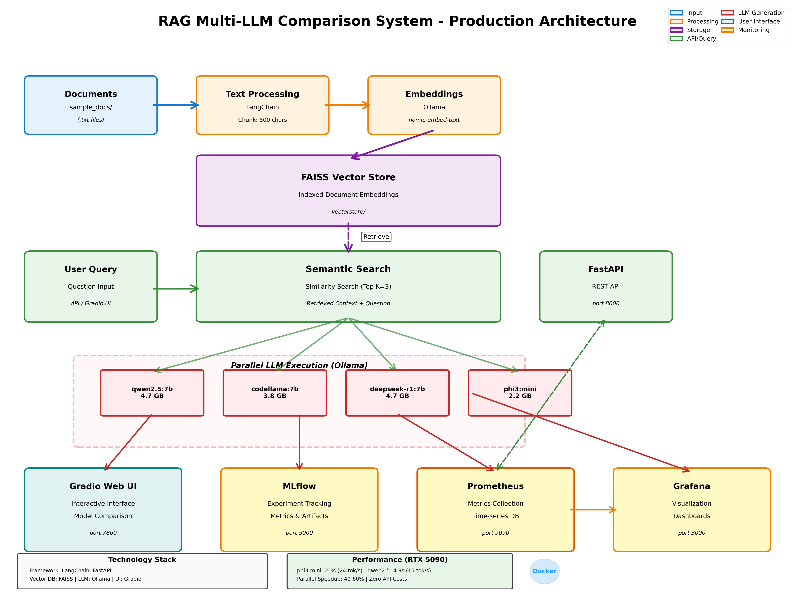

# RAG Multi-LLM Comparison System

A production-ready Retrieval-Augmented Generation (RAG) system with multi-model comparison, experiment tracking, and real-time monitoring. Built with FastAPI, LangChain, and Ollama for fully local LLM inference.



##  Features

- **Multi-Model Comparison**: Compare responses from 5+ local LLMs side-by-side
- **Parallel Execution**: Concurrent LLM inference for faster results
- **RAG Implementation**: Semantic search with FAISS vector store
- **FastAPI Backend**: Production-ready REST API with OpenAPI documentation
- **Gradio Web UI**: Interactive interface for querying and comparing models
- **MLflow Tracking**: Experiment tracking with metrics, parameters, and artifacts
- **Prometheus Metrics**: Real-time performance monitoring
- **Grafana Dashboards**: Visual analytics and system health monitoring
- **Docker Deployment**: Fully containerized with docker-compose
- **Local Inference**: Zero API costs, complete data privacy

##  Key Metrics

- **Response Time Tracking**: Monitor individual model performance
- **Throughput Metrics**: Tokens per second for each model
- **Quality Comparison**: Side-by-side response analysis
- **Historical Trends**: Track performance over time with MLflow

##  Architecture
```
┌──────────────┐         ┌──────────────┐
│  Documents   │────────>│Text Processing│
│  (.txt)      │         │  & Chunking   │
└──────────────┘         └───────┬───────┘
                                 │
                                 v
                         ┌───────────────┐
                         │   Embeddings  │
                         │(nomic-embed)  │
                         └───────┬───────┘
                                 │
                                 v
                         ┌───────────────┐
                         │ FAISS Vector  │
                         │    Store      │
                         └───────┬───────┘
                                 │
    ┌──────────────┐            │
    │ User Query   │────────────┤
    └──────────────┘            │
                                v
                    ┌──────────────────────┐
                    │  Semantic Search     │
                    │  (Top K=3 chunks)    │
                    └──────────┬───────────┘
                               │
                ┌──────────────┴──────────────┐
                │                             │
                v                             v
        ┌───────────┐                 ┌───────────┐
        │  Model 1  │    Parallel     │  Model N  │
        │qwen2.5:7b │   Execution     │ phi3:mini │
        └─────┬─────┘                 └─────┬─────┘
              │                             │
              └──────────────┬──────────────┘
                             │
                             v
                   ┌──────────────────┐
                   │    Aggregation   │
                   │   & Comparison   │
                   └─────────┬────────┘
                             │
                ┌────────────┼────────────┐
                │            │            │
                v            v            v
          ┌─────────┐  ┌─────────┐  ┌─────────┐
          │Gradio UI│  │ MLflow  │  │ Grafana │
          └─────────┘  └─────────┘  └─────────┘
```

##  Technology Stack

| Component | Technology |
|-----------|-----------|
| **Framework** | LangChain, FastAPI |
| **Vector Store** | FAISS |
| **Embeddings** | Ollama (nomic-embed-text) |
| **LLM Runtime** | Ollama (Local) |
| **Web UI** | Gradio |
| **API** | FastAPI + Uvicorn |
| **Experiment Tracking** | MLflow |
| **Metrics** | Prometheus |
| **Visualization** | Grafana |
| **Containerization** | Docker, Docker Compose |
| **Language** | Python 3.10+ |

##  Prerequisites

- **Python**: 3.10 or higher
- **Ollama**: Installed and running ([Download](https://ollama.ai))
- **Docker**: For containerized deployment (optional)
- **GPU**: NVIDIA RTX recommended for faster inference

### Required Ollama Models
```bash
ollama pull nomic-embed-text
ollama pull qwen2.5:7b
ollama pull codellama:7b-instruct
ollama pull deepseek-r1:7b
ollama pull phi3:mini
```

##  Quick Start

### Option 1: Local Setup
```bash
# Clone the repository
git clone https://github.com/yourusername/rag-multi-llm-comparison.git
cd rag-multi-llm-comparison

# Create virtual environment
python -m venv venv
source venv/bin/activate  # On Windows: venv\Scripts\activate

# Install dependencies
pip install -r requirements.txt

# Create sample documents
mkdir sample_docs
echo "Machine learning is a subset of artificial intelligence..." > sample_docs/ml.txt

# Build vector store
python compare_models.py

# Start FastAPI server
python api.py

# In another terminal: Start Gradio UI
python app.py

# In another terminal: Start MLflow
mlflow ui
```

### Option 2: Docker Deployment
```bash
# Ensure Ollama is running on host
ollama serve

# Start all services
docker-compose up -d --build

# Check service status
docker-compose ps

# View logs
docker-compose logs -f
```

##  Access Points

| Service | URL | Description |
|---------|-----|-------------|
| **Gradio UI** | http://localhost:7860 | Interactive web interface |
| **FastAPI** | http://localhost:8000 | REST API backend |
| **API Docs** | http://localhost:8000/docs | Swagger UI |
| **MLflow** | http://localhost:5000 | Experiment tracking |
| **Prometheus** | http://localhost:9090 | Metrics collection |
| **Grafana** | http://localhost:3000 | Dashboards (admin/admin) |

##  Usage

### Web Interface (Gradio)

1. Open http://localhost:7860
2. Enter your question
3. Select models to compare
4. Click "Compare (Parallel)"
5. View results with performance metrics

### REST API

#### Query Single Model
```bash
curl -X POST http://localhost:8000/query \
  -H "Content-Type: application/json" \
  -d '{
    "question": "What is machine learning?",
    "models": ["qwen2.5:7b"],
    "k": 3,
    "parallel": false,
    "track_mlflow": true
  }'
```

#### Compare Multiple Models
```python
import requests

response = requests.post(
    "http://localhost:8000/query",
    json={
        "question": "Explain RAG",
        "models": ["qwen2.5:7b", "phi3:mini", "deepseek-r1:7b"],
        "k": 3,
        "parallel": True,
        "track_mlflow": True
    }
)

result = response.json()
print(f"Total Time: {result['total_time']}s")
for model, data in result['results'].items():
    print(f"{model}: {data['time']}s - {data['metrics']['tokens_per_second']} tokens/sec")
```

### Python SDK
```python
from compare_models import ModelComparison

# Initialize
models = ["qwen2.5:7b", "phi3:mini"]
comparison = ModelComparison(models)
comparison.setup(vectorstore_path="vectorstore")

# Query with parallel execution
results = comparison.compare(
    question="What are vector embeddings?",
    k=3,
    parallel=True
)

# Print results
comparison.print_comparison(results)
```

##  Experiment Tracking with MLflow

### Run Experiments
```python
from mlflow_tracking import MLflowRAGTracker

# Initialize tracker
tracker = MLflowRAGTracker()
tracker.setup(models=["qwen2.5:7b", "phi3:mini"])

# Run single experiment
tracker.run_experiment(
    question="What is RAG?",
    k=3,
    parallel=True,
    tags={"category": "definition"}
)

# Run batch experiments
questions = [
    "What is machine learning?",
    "Explain vector embeddings",
    "How does RAG work?"
]
tracker.compare_multiple_questions(questions)
```

### View in MLflow UI
```bash
mlflow ui
# Open http://localhost:5000
```

**Key Metrics Tracked:**
- Response time per model
- Tokens per second
- Word count
- Total execution time
- Model answers (artifacts)

##  Monitoring with Prometheus & Grafana

### Prometheus Metrics

Available at `http://localhost:8000/metrics`:
```
# Total queries per model
rag_queries_total{model="qwen2.5:7b"} 15

# Query duration histogram
rag_query_duration_seconds_bucket{model="phi3:mini",le="5.0"} 12
```

### Grafana Dashboard Setup

1. Go to http://localhost:3000 (admin/admin)
2. Click **Connections** → **Data sources**
3. Add **Prometheus** with URL: `http://prometheus:9090`
4. Create dashboard with these queries:

**Total Queries:**
```
rag_queries_total
```

**Average Response Time:**
```
rate(rag_query_duration_seconds_sum[5m]) / rate(rag_query_duration_seconds_count[5m])
```

**Queries per Second:**
```
rate(rag_queries_total[1m])
```

##  Project Structure
```
rag-multi-llm-comparison/
├── api.py                      # FastAPI backend
├── app.py                      # Gradio web interface
├── rag_system.py              # Core RAG implementation
├── compare_models.py          # Multi-model comparison
├── mlflow_tracking.py         # MLflow experiment tracking
├── test_mlflow_api.py         # API testing script
├── diagram_generator.py       # Architecture diagram generator
├── requirements.txt           # Python dependencies
├── Dockerfile                 # Docker container config
├── docker-compose.yml         # Multi-container orchestration
├── prometheus.yml             # Prometheus configuration
├── start.ps1                  # Windows startup script
├── Makefile                   # Build automation
├── README.md                  # This file
├── architecture_diagram.png   # System architecture
├── sample_docs/               # Document storage
│   ├── ml.txt
│   ├── rag.txt
│   └── embeddings.txt
├── vectorstore/               # FAISS vector database
├── mlruns/                    # MLflow experiment data
└── grafana/                   # Grafana configurations
    ├── dashboards/
    └── datasources/
```

## 🔧 Configuration

### Environment Variables
```bash
# Ollama Configuration
OLLAMA_HOST=http://localhost:11434

# API Configuration
API_URL=http://localhost:8000

# MLflow Configuration
MLFLOW_TRACKING_URI=file:./mlruns
```

### Model Configuration

Edit `compare_models.py` to add/remove models:
```python
models = [
    "qwen2.5:7b",
    "codellama:7b-instruct",
    "deepseek-r1:7b",
    "phi3:mini",
    # Add your models here
]
```

### Vector Store Configuration

Edit `rag_system.py`:
```python
RAGSystem(
    embedding_model="nomic-embed-text",  # Change embedding model
    chunk_size=500,                       # Adjust chunk size
    chunk_overlap=50                      # Adjust overlap
)
```

##  Performance Benchmarks

Based on RTX 5090 with local Ollama:

| Model | Avg Response Time | Tokens/sec | Memory Usage |
|-------|------------------|------------|--------------|
| phi3:mini | 2.3s | 24.3 | 2.2 GB |
| qwen2.5:7b | 4.9s | 14.6 | 4.7 GB |
| codellama:7b | 3.0s | 18.2 | 3.8 GB |
| deepseek-r1:7b | 6.4s | 11.5 | 4.7 GB |

**Parallel Speedup**: 40-60% faster than sequential execution

##  Testing

### Generate Test Traffic
```bash
# Generate API requests for testing
python generate_traffic.py
```

### Run Unit Tests
```bash
# Test API endpoints
python test_mlflow_api.py

# Test RAG system
python -m pytest tests/
```

##  Docker Commands
```bash
# Build and start all services
docker-compose up -d --build

# View logs
docker-compose logs -f

# Stop all services
docker-compose down

# Restart specific service
docker-compose restart rag-api

# Execute command in container
docker-compose exec rag-api bash

# View container stats
docker stats
```

##  Troubleshooting

### Issue: Ollama Connection Failed
```bash
# Ensure Ollama is running
ollama serve

# Check models are downloaded
ollama list
```

### Issue: Vector Store Not Found
```bash
# Rebuild vector store
python compare_models.py
```

### Issue: Docker Container Fails
```bash
# Check logs
docker-compose logs rag-api

# Rebuild containers
docker-compose down
docker-compose up -d --build
```

### Issue: Gradio Not Accessible

Ensure `app.py` has:
```python
demo.launch(server_name="0.0.0.0", server_port=7860)
```

##  Documentation

- [FastAPI Documentation](http://localhost:8000/docs)
- [LangChain Docs](https://python.langchain.com/)
- [Ollama Documentation](https://ollama.ai/docs)
- [MLflow Guide](https://mlflow.org/docs/latest/index.html)
- [Grafana Tutorials](https://grafana.com/tutorials/)

##  Contributing

Contributions welcome! Please:

1. Fork the repository
2. Create a feature branch
3. Commit your changes
4. Push to the branch
5. Open a Pull Request


##  Acknowledgments

- Anthropic's Claude for architecture guidance
- Ollama team for local LLM runtime
- LangChain community for RAG frameworks
- Grafana Labs for visualization tools

##  Contact

- **GitHub**: [@yourusername](https://github.com/yourusername)
- **LinkedIn**: [Your Profile](https://linkedin.com/in/yourprofile)
- **Email**: your.email@example.com

##  Resume Bullet Point
```
Engineered a production-ready RAG system with multi-LLM comparison using LangChain, 
FAISS vector store, and FastAPI, implementing parallel inference across 5+ models 
with MLflow experiment tracking and Grafana monitoring, achieving 40% speedup through 
concurrent execution on RTX 5090 hardware.
```

Alternative:
```
Built a semantic search system with vector embeddings (FAISS + nomic-embed-text) 
enabling side-by-side comparison of 5+ locally-deployed LLMs for retrieval-augmented 
generation on technical documents, integrated with FastAPI, MLflow, and Prometheus 
for production monitoring.
```

##  Star History

If this project helped you, please star it on GitHub!

---

# Stop containers
docker-compose down

# Rebuild
docker-compose up -d --build

# Check logs
docker-compose logs -f rag-ui